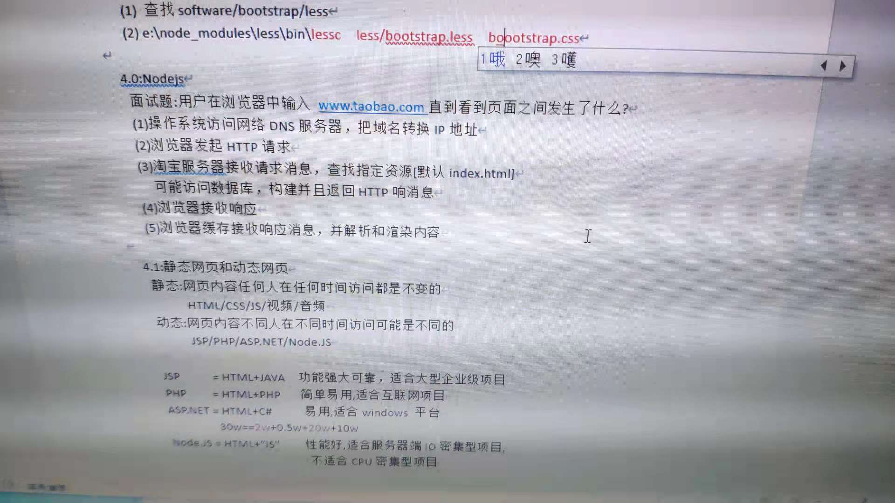
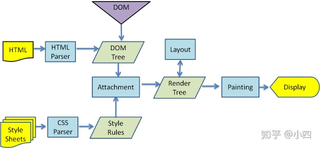

### 1.JS task 到底是怎么运行的 [参考](https://github.com/rhinel/blog-word/issues/4)

### 2.用户在浏览器中输入www.taobao.com直到看到页面之间发生了什么？

- 1.浏览器访问网络 DNS 服务器，把域名转换为 ip 地址。

- 2.TCP建立连接：TCP 三次握手（传输控制协议（TCP，Transmission Control Protocol）

  > 1.客户端发送一个带 SYN=1，Seq=X 的数据包到服务器端口（第一次握手，由浏览器发起，告诉服务器我要发送请求了）   
    2.服务器发回一个带 SYN=1， ACK=X+1， Seq=Y 的响应包以示传达确认信息（第二次握手，由服务器发起，告诉浏览器我准备接受了，你赶紧发送吧）  
    3.客户端再回传一个带 ACK=Y+1， Seq=Z 的数据包，代表“握手结束”（第三次握手，由浏览器发送，告诉服务器，我马上就发了，准备接受吧）
- 3.浏览器根据解析得到的ip地址，向web服务器发起 http 请求。

- 4.淘宝服务器接收请求消息，查找指定资源(默认 index.html)。可能访问数据库，构建并且返回 HTTP 响应消息

- 5.浏览器接收并缓存响应消息，然后解析和渲染内容

- 6.TCP断开连接：TCP 四次挥手

  > 1.发起方向被动方发送报文，Fin、Ack、Seq，表示已经没有数据传输了。并进入 FIN_WAIT_1 状态。(第一次挥手：由浏览器发起的，发送给服务器，我请求报文发送完了，你准备关闭吧)   
    2.被动方发送报文，Ack、Seq，表示同意关闭请求。此时主机发起方进入 FIN_WAIT_2 状态。(第二次挥手：由服务器发起的，告诉浏览器，我请求报文接受完了，我准备关闭了，你也准备吧)  
    3.被动方向发起方发送报文段，Fin、Ack、Seq，请求关闭连接。并进入 LAST_ACK 状态。(第三次挥手：由服务器发起，告诉浏览器，我响应报文发送完了，你准备关闭吧)   
    4.发起方向被动方发送报文段，Ack、Seq。然后进入等待 TIME_WAIT 状态。被动方收到发起方的报文段以后关闭连接。发起方等待一定时间未收到回复，则正常关闭。(第四次挥手：由浏览器发起，告诉服务器，我响应报文接受完了，我准备关闭了，你也准备吧)

  

> Q:为什么建立连接是三次握手，而关闭连接却是四次挥手呢？  
> A:这是因为服务端在LISTEN状态下，收到建立连接请求的SYN报文后，把ACK和SYN放在一个报文里发送给客户端。而关闭连接时，当收到对方的FIN报文时，仅仅表示对方不再发送数据了但是还能接收数据，己方也未必全部数据都发送给对方了，所以己方可以立即close，也可以发送一些数据给对方后，再发送FIN报文给对方来表示同意现在关闭连接，因此，己方ACK和FIN一般都会分开发送。（https://www.jianshu.com/p/ef892323e68f）

> Q:为啥需要三次握手  
> A:谢希仁著《计算机网络》中讲“三次握手”的目的是“为了防止已失效的连接请求报文段突然又传送到了服务端，因而产生错误”。

[参考 1](https://blog.csdn.net/JackieDYH/article/details/108153947)

第一步 浏览器查找该域名的 IP 地址
第二步 浏览器根据解析得到的 IP 地址向 web 服务器发送一个 HTTP 请求
第三步 服务器收到请求并进行处理
第四步 服务器返回一个响应
第五步 浏览器对该响应进行解码，渲染显示。
第六步 页面显示完成后，浏览器发送异步请求。
第七步 整个过程结束之后，浏览器关闭 TCP 连接。

[参考 2](https://zhuanlan.zhihu.com/p/78677852)

[参考 3-浏览器渲染原理及流程](https://www.cnblogs.com/slly/p/6640761.html)

渲染主流程:

下面是渲染引擎在取得内容之后的基本流程：

> 解析 html 以构建 dom 树 -> 构建 render 树 -> 布局 render 树 -> 绘制 render 树

这里先解释一下几个概念，方便大家理解：

- DOM Tree：浏览器将 HTML 解析成树形的数据结构。
- CSS Rule Tree：浏览器将 CSS 解析成树形的数据结构。
- Render Tree: DOM 和 CSSOM 合并后生成 Render Tree。
- layout: 有了 Render Tree，浏览器已经能知道网页中有哪些节点、各个节点的 CSS 定义以及他们的从属关系，从而去计算出每个节点在屏幕中的位置。
- painting: 按照算出来的规则，通过显卡，把内容画到屏幕上。

* reflow（回流）：当浏览器发现某个部分发生了点变化影响了布局，需要倒回去重新渲染，内行称这个回退的过程叫 reflow。reflow 会从 <html> 这个 root frame 开始递归往下，依次计算所有的结点几何尺寸和位置。reflow 几乎是无法避免的。现在界面上流行的一些效果，比如树状目录的折叠、展开（实质上是元素的显 示与隐藏）等，都将引起浏览器的 reflow。鼠标滑过、点击……只要这些行为引起了页面上某些元素的占位面积、定位方式、边距等属性的变化，都会引起它内部、周围甚至整个页面的重新渲 染。通常我们都无法预估浏览器到底会 reflow 哪一部分的代码，它们都彼此相互影响着。

- repaint（重绘）：改变某个元素的背景色、文字颜色、边框颜色等等不影响它周围或内部布局的属性时，屏幕的一部分要重画，但是元素的几何尺寸没有变。

**注意:**

1.display:none 的节点不会被加入 Render Tree，而 visibility: hidden 则会，所以，如果某个节点最开始是不显示的，设为 display:none 是更优的。

2.display:none 会触发 reflow，而 visibility:hidden 只会触发 repaint，因为没有发现位置变化。

3.有些情况下，比如修改了元素的样式，浏览器并不会立刻 reflow 或 repaint 一次，而是会把这样的操作积攒一批，然后做一次 reflow，这又叫异步 reflow 或增量异步 reflow。但是在有些情况下，比如 resize 窗口，改变了页面默认的字体等。对于这些操作，浏览器会马上进行 reflow。

**_结果_**

1. 浏览器会将 HTML 解析成一个 DOM 树，DOM 树的构建过程是一个深度遍历过程：当前节点的所有子节点都构建好后才会去构建当前节点的下一个兄弟节点。

2. 将 CSS 解析成 CSS Rule Tree 。

3. 根据 DOM 树和 CSSOM 来构造 Rendering Tree。注意：Rendering Tree 渲染树并不等同于 DOM 树，因为一些像 Header 或 display:none 的东西就没必要放在渲染树中了。

4. 有了 Render Tree，浏览器已经能知道网页中有哪些节点、各个节点的 CSS 定义以及他们的从属关系。下一步操作称之为 layout，顾名思义就是计算出每个节点在屏幕中的位置。

5. 再下一步就是绘制，即遍历 render 树，并使用 UI 后端层绘制每个节点。

[参考4-从 URL 输入到页面展现到底发生什么？](https://zhuanlan.zhihu.com/p/57895541)

渲染引擎首先通过网络获得所请求文档的内容，通常以8K分块的方式完成。下面是渲染引擎在取得内容之后的基本流程：
浏览器解析渲染页面分为一下五个步骤：
+ 根据 HTML 解析成 DOM 树
+ 根据 CSS 解析生成 CSS 规则树
+ 结合 DOM 树和 CSS 规则树，生成渲染树（render tree)
+ 根据渲染树计算每一个节点的信息
+ 根据计算好的信息绘制页面
