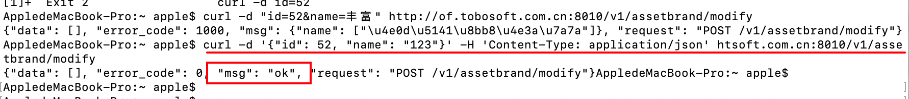

### 清空DNS缓存的方法：
[参考](https://laod.cn/hosts/switchhosts.html)  
>1.在 Windows 下命令行执行：ipconfig /flushdns  
>2.在 Windows 下命令行执行：ipconfig /flushdns  
>3.在 macOS 下执行命令：sudo killall -HUP mDNSResponder  

### curl命令学习 
[参考](http://www.ruanyifeng.com/blog/2019/09/curl-reference.html)
> 

### 在线演示(动画演示)各种算法的实现过程
[参考](https://www.cs.usfca.edu/~galles/visualization/Algorithms.html)